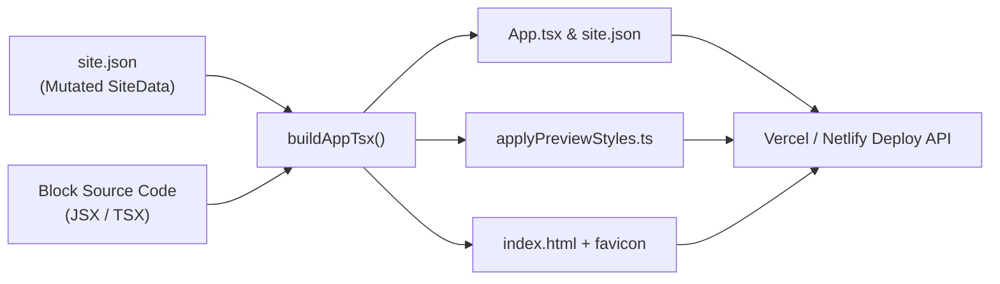

# PortfolioHub System Architecture & Full Lifecycle Guide

This document is the authoritative technical reference for **PortfolioHub**. It details the complete workflow from opening a template to fine-tuning styles, handling responsive breakpoints, and compiling the production bundle for deployment.

---

## 1. High-Level Architecture Overview

PortfolioHub is a visual portfolio site builder. It allows users to pick professional templates, customize themes, replace images and logos, reorder blocks, edit text inline or via panels, and fine-tune individual elements with responsive styles and animations before deploying to Vercel or Netlify.

```
┌────────────────────────────────────────────────────────────────────────┐
│                        PORTFOLIOHUB SYSTEM                             │
└────────────────────────────────────────────────────────────────────────┘
                                 │
     ┌───────────────────────────┼───────────────────────────┐
     ▼                           ▼                           ▼
1. TEMPLATES             2. EDITOR ENGINE            3. DEPLOY COMPILER
src/data/templates/      TemplatePreviewDialog       buildAppTsx.ts
(Raw JSON sources)       TemplateLivePreview         buildViewerAppFiles.ts
                         TemplateSidebar             applyPreviewStyles.template.ts
                         ElementStylePanel           buildHtml.ts
```

---

## 2. Template Opening & Immutability Lifecycle

### A. Raw Template Storage
Master templates are stored as static JSON files in `src/data/templates/`:
- `startup-founder-paper-airy.json`
- `modern-developer-dark.json`
- `creative-director-bold.json`
- ...

### B. Isolated Deep Copy on Open
When a user clicks **"Use Template"**, the editor mounts `TemplatePreviewDialog.tsx`:
1. `syncTemplateState()` is invoked.
2. It executes:
   ```ts
   const nextSite = structuredClone(template);
   setSite(nextSite);
   ```
3. **Immutability Guarantee**: `structuredClone` creates a separate memory copy in React state. The original template JSON files on disk are **never modified**.

---

## 3. Data Structure: Before vs. After Edit

### Structure Before Edit (Clean Template JSON)
```json
{
  "id": "startup-founder-paper-airy",
  "name": "Startup Founder",
  "category": "AIProduct",
  "logo": null,
  "theme": {
    "bg": "#140C12",
    "bg-second": "#FFF5F8",
    "accent": "#FF3B76",
    "surface": "#231420",
    "ink": "#FFFFFF",
    "ink-second": "#1E0C17",
    "fontHeading": "Inter",
    "fontBody": "Inter",
    "corners": "rounded",
    "spacing": "cozy"
  },
  "blocks": [
    {
      "id": "navbar-1",
      "order": 0,
      "props": { "kind": "navbar", "variant": "AIProduct3Navbar" }
    },
    {
      "id": "hero-1",
      "order": 1,
      "props": { "kind": "hero", "variant": "AIProduct3Hero" }
    }
  ]
}
```

### Structure After User Customization (`SiteData`)
```json
{
  "id": "startup-founder-paper-airy",
  "name": "Startup Founder",
  "category": "AIProduct",
  "logo": "https://<supabase-project>.supabase.co/storage/v1/object/public/site-assets/logos/e2a14bc0.png",
  "theme": {
    "bg": "#0D080C",
    "bg-second": "#FFF5F8",
    "accent": "#FF2A6D",
    "surface": "#1A0F17",
    "ink": "#FFFFFF",
    "ink-second": "#1E0C17"
  },
  "blocks": [
    {
      "id": "navbar-1",
      "order": 0,
      "props": {
        "kind": "navbar",
        "variant": "AIProduct3Navbar",
        "logo": "https://<supabase-project>.supabase.co/storage/v1/object/public/site-assets/logos/e2a14bc0.png"
      }
    },
    {
      "id": "hero-1",
      "order": 1,
      "height": 720,
      "props": {
        "kind": "hero",
        "variant": "AIProduct3Hero",
        "_textOverrides": {
          "0": "Next-Gen Intelligent Automation",
          "1": "Transform your business workflows with our autonomous AI agents."
        },
        "_imageOverrides": {
          "https://images.unsplash.com/default-hero.jpg": "https://<supabase-project>.supabase.co/storage/v1/object/public/site-assets/logos/custom-hero.png"
        }
      }
    }
  ],
  "previewEdits": {
    "elements": {
      "hero-1:0.1.0": {
        "id": "hero-1:0.1.0",
        "blockId": "hero-1",
        "blockKind": "hero",
        "label": "Element",
        "style": {
          "fontSize": 48,
          "fontWeight": "700",
          "color": "#FFFFFF",
          "hoverEffect": "lift",
          "entrance": "slideUp",
          "entranceDuration": 0.5,
          "responsive": {
            "desktop": {
              "fontSize": 56,
              "lineHeight": 1.15
            },
            "tablet": {
              "fontSize": 42,
              "lineHeight": 1.2
            },
            "mobile": {
              "fontSize": 32,
              "lineHeight": 1.25,
              "textAlign": "center"
            }
          }
        }
      },
      "hero-1:root": {
        "id": "hero-1:root",
        "blockId": "hero-1",
        "blockKind": "hero",
        "label": "hero",
        "style": {
          "padding": 64,
          "backgroundColor": "#0D080C"
        }
      }
    }
  }
}
```

---

## 4. Subsystem Pipelines

### A. Theme Colors (Live Preview Header)
1. **Trigger**:
   - Displayed in the top preview header on the left side (`TemplateLivePreview.tsx`) via `<ThemeCircleRow>`.
   - Rendered as compact, vertically centered circular swatches with no text labels.
   - Clicking a circle opens the Popover HSV/Hex picker.
2. **Mutation**:
   - Calls `onThemeChange({ [key]: hex })` -> `updateTheme(setSite, patch)`.
   - `setSite((prev) => ({ ...prev, theme: { ...prev.theme, ...patch } }))`.
3. **Application**:
   - Template blocks consume `theme.bg`, `theme.accent`, `theme.surface`, `theme.ink`.
   - Components immediately re-render live in the browser preview.
   - Build-time: Injected into CSS custom properties (`--ai-theme-bg`, `--ai-theme-accent`, etc.) and root `<main>` styles.

### B. Logo Upload & Storage (Supabase Storage)
1. **Trigger**:
   - User clicks the logo upload box in `TemplateSidebar.tsx`.
2. **Upload Execution (`src/lib/uploadLogo.ts`)**:
   - Validates file type (`image/png`, `jpeg`, `svg+xml`, `webp`, `gif`) and size (`<= 5 MB`).
   - Generates a unique UUID path: `logos/${crypto.randomUUID()}.${ext}`.
   - Uploads directly to the Supabase Storage bucket `"site-assets"`.
   - Retrieves the permanent public CDN URL via `supabase.storage.from("site-assets").getPublicUrl(path)`.
3. **Application**:
   - Saved to `site.logo`.
   - Passed live to `Navbar` and `Footer` components.
   - Build-time: Injected as the website favicon `<link rel="icon" href="${site.logo}" />` and as props to the production navigation header.

### C. Text Editing (Inline & Sidebar)
1. **Inline Editing**:
   - Text elements are wrapped in `<Editable>` from `Editable.tsx`.
   - Utilizes browser `contentEditable`.
   - On `blur`, `handleEditableBlur` writes the new string into block state.
2. **Sidebar "Text" Tab**:
   - `TextPanel` queries DOM nodes matching `[data-editable][data-text-index]`.
   - Edits are saved into `block.props._textOverrides[index]`.
   - `TextOverrideProvider` feeds overrides down to components.
3. **Build-Time**:
   - `App.tsx` wraps each block in `<TextOverrideProvider overrides={siteData.blocks[i].props._textOverrides}>`.
   - Deployed sites display all custom text seamlessly.

### D. Image Replacement
1. **Trigger**:
   - Sidebar "Images" tab discovers all images within the active template.
   - User clicks to replace an image file.
2. **Storage**:
   - Uploaded to Supabase Storage via `uploadSiteLogo(file)`.
3. **Mapping**:
   - Stored in `block.props._imageOverrides[originalSrc] = newSupabaseUrl`.
4. **Build-Time (`buildAppTsx.ts`)**:
   - The compiler reads the block source code:
     ```ts
     content = content.split(oldUrl).join(newUrl);
     ```
   - Replaces hardcoded template image URLs directly in the compiled component source.

### E. Element Fine-Tuning (`ElementStylePanel`)
1. **Selection**:
   - Clicking any element in edit mode sets `selectedElement` (`id: `${blockId}:${elementPath}``).
   - Sidebar switches to `ElementStylePanel.tsx`.
   - **UI Design**: Docked flush with `w-[320px] rounded-none border-r border-border border-l`, perfectly matching `TemplateSidebar`.
   - **Contextual Header**: Displays clean label (`Element Style` / `hero section · desktop`) without spilling raw text content into the header.
2. **Five Functional Tabs**:
   - **Text**: Font family, font size, line height, letter spacing, bold/italic/underline/strikethrough, alignment, text color, text shadow.
   - **Fill**: Solid background color, gradient presets (7 presets + custom angle/stops), opacity slider.
   - **Border**: Corner radius presets (Sharp, Rounded, Pill + slider), border thickness, border style (solid, dashed, dotted), border color.
   - **FX**: Card presets (Glassmorphism, Elevated, Outline), hover effects (`grow`, `lift`, `glow`, `darken`), entrance animations (`fade`, `slideUp`, `zoom`) with duration slider.
   - **Layout**: Spacing presets (Tight, Cozy, Roomy), custom padding & margin, width/height (with arrow-key bumping), cursor type, overflow mode.
3. **Footer Controls**:
   - **Show / Hide**: Sets `style.removed = true` (renders `display: none`).
   - **Remove**: Deletes style modifications.

---

## 5. Responsive System & Cascading Logic

PortfolioHub supports independent, per-device style customization:

### Breakpoint Matrix
| Breakpoint | Screen Width Range | Usage |
| :--- | :--- | :--- |
| **Desktop** | `>= 1024px` | Default base styling |
| **Tablet** | `768px - 1023px` | Tablet portrait & landscape overrides |
| **Mobile** | `0px - 767px` | Smartphone compact overrides |

### Cascade Resolution (`resolveResponsiveValue`)
When rendering an element style:
```ts
function resolveResponsiveValue(style, key, breakpoint) {
  // 1. Check if an explicit override exists for the active breakpoint
  if (style.responsive?.[breakpoint]?.[key] !== undefined) {
    return style.responsive[breakpoint][key];
  }
  // 2. Fall back to base / desktop value
  return style[key];
}
```
In edit mode:
- Changing a property while `breakpoint === "mobile"` writes to:
  `style.responsive.mobile[prop] = value`
- Other breakpoints remain unaffected.

---

## 6. Build Time & Production Deployment

When the user confirms **Save & Deploy**:



### 1. `buildAppTsx.ts`
- Imports each active block in order:
  ```tsx
  import Block0 from "./components/editor/TemplatesUI/AIProduct/3/navbar";
  import Block1 from "./components/editor/TemplatesUI/AIProduct/3/hero";
  ```
- Patches block source files with image overrides.
- Injects theme CSS custom variables and text override providers.

### 2. `applyPreviewStyles.template.ts` (Runtime Style Engine)
The compiled site includes `applyAllPreviewEdits()`, running on `useLayoutEffect`, window `resize`, and via a `MutationObserver`:
- **Responsive Updates**: Calculates `breakpointFromWidth(window.innerWidth)` dynamically when the user rotates their phone or resizes the browser.
- **Micro-Animations**: Injects keyframes and CSS classes for hover effects (`[data-hover-fx="lift"]`) and entrance animations (`[data-entrance-fx="slideUp"]`).
- **Styles**: Applies all font sizes, colors, borders, paddings, glassmorphism, and custom dimensions directly to the DOM nodes.

### 3. `buildHtml.ts` & `buildSeoFiles.ts`
- Injects the Supabase logo as the site favicon `<link rel="icon" href="${site.logo}" />`.
- Generates `sitemap.xml` and `robots.txt` for production search engine indexing.

---

## 7. Verification Checklist

- [x] **Template Immutability**: `structuredClone` guarantees source JSONs remain untouched.
- [x] **Theme Switcher**: Integrated in the live preview header on the left, vertically centered, no scrollbars.
- [x] **Logo Pipeline**: Uploaded to Supabase Storage, stored as a public HTTPS URL, rendered in navbar, and set as favicon.
- [x] **Element Style Panel**: Flat docked borders (`rounded-none`, `320px`), clean title (`Element Style`), no raw text leakage.
- [x] **Responsive Styles**: Stored under `style.responsive[breakpoint]` and evaluated live and in production builds.
- [x] **Animations**: Hover effects and entrance animations compiled into CSS rules and applied on both preview and deployed sites.
- [x] **TypeScript Compliance**: Full project compiles cleanly with `npx tsc --noEmit` (0 errors).
